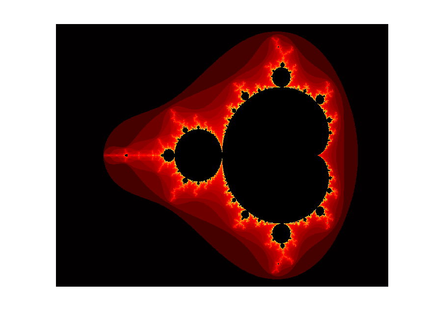

# Usando GPUs para criação de imagens de fractais de forma paralela

**This work is part of the High Performance Computer Architecture class at the Federal University of São Carlos, Brazil. Thus, it was done in Portuguese.**

## Relatório completo

A explicação completa da implementação pode ser lida no [relatório](relatorio/relatorio.pdf).

## Resultados

### Comparação do tempo de execução (em segundos) (para uma imagem 1000x1000):

| Método         | N = 10   | N = 100  | N = 1000 | N = 10000 |
| -------------- | -------- | -------- | -------- | --------- |
| CPU            | 0.080960 | 0.591018 | 5.403639 | 52.253612 |
| GPU            | 0.005314 | 0.010240 | 0.068769 | 12.089377 |
| GPU + arrayfun | 0.000647 | 0.000682 | 0.000740 | 0.002888  |

### Imagens geradas:

