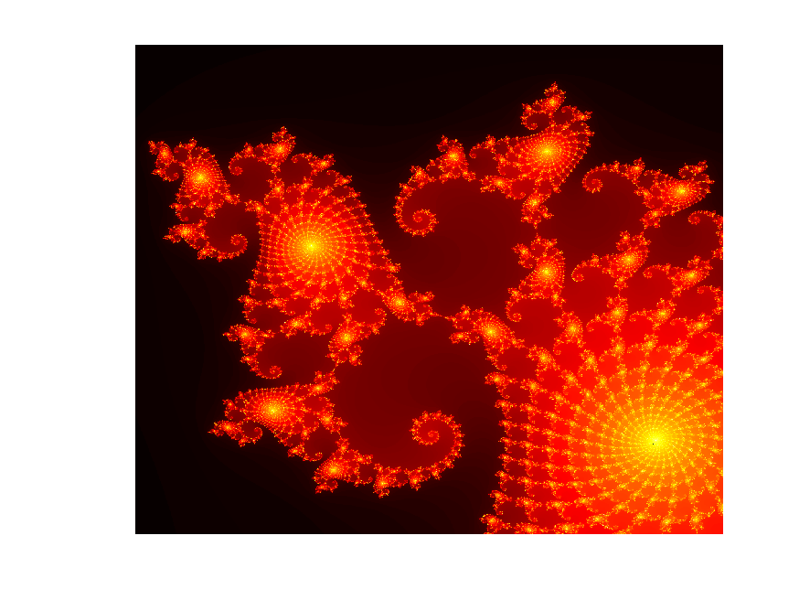

# Usando GPUs para criação de imagens de fractais de forma paralela

**This work is part of the High Performance Computer Architecture class at the Federal University of São Carlos, Brazil. Thus, it was done in Portuguese.**

## Resultados

